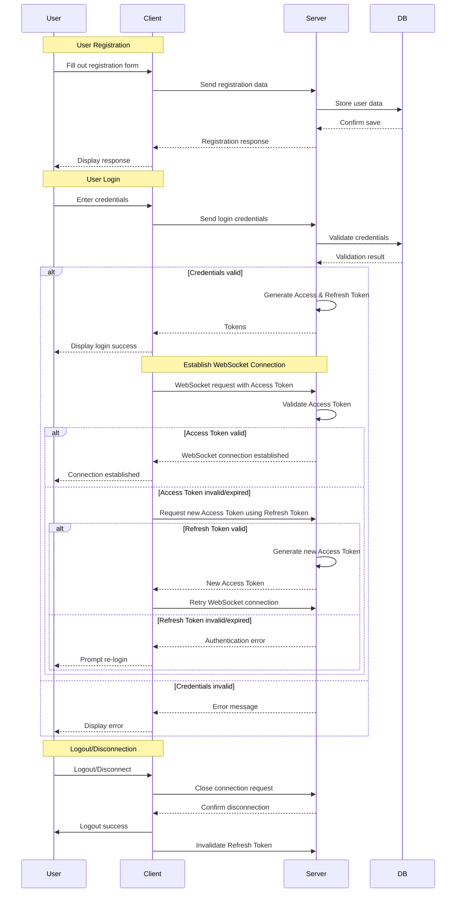

# ChatApp: Real-Time Chat Application

## Introduction

ChatApp is a real-time chat application built with [React](https://reactjs.org/), [Node.js](https://nodejs.org/), and [WebSocket](https://developer.mozilla.org/en-US/docs/Web/API/WebSockets_API) technology. It features user authentication, one-on-one messaging, and group chats.

## Features

- **User Authentication**: Secure login and registration system.
- **Real-Time Messaging**: Instantly send and receive messages using WebSockets.
- **Group Chats**: Create group chats with multiple users.
- **Message Persistence**: Messages are stored and retrieved from a database.
- **Token Refresh**: Secure handling of authentication tokens with refresh capability.
- **Responsive Design**: Compatible with desktop and mobile devices.

## Technology Stack

- **Frontend**: React, and Tailwind for styling.
- **Backend**: Node.js with Express, WebSocket for real-time communication, and MongoDB as the database.
- **Authentication**: JWT for secure token-based authentication.

## Getting Started

### Prerequisites

- [Node.js](https://nodejs.org/en/download/)
- [MongoDB](https://www.mongodb.com/try/download/community)

### Installation

1. Clone the repository:

   ```bash
    git clone https://github.com/your-username/chatapp.git
   ```

2. Install dependencies for the server:
   ```bash
   cd chatapp
   npm install
   ```
3. Install dependencies for the client:
   ```bash
    cd client
    npm install
   ```
4.


